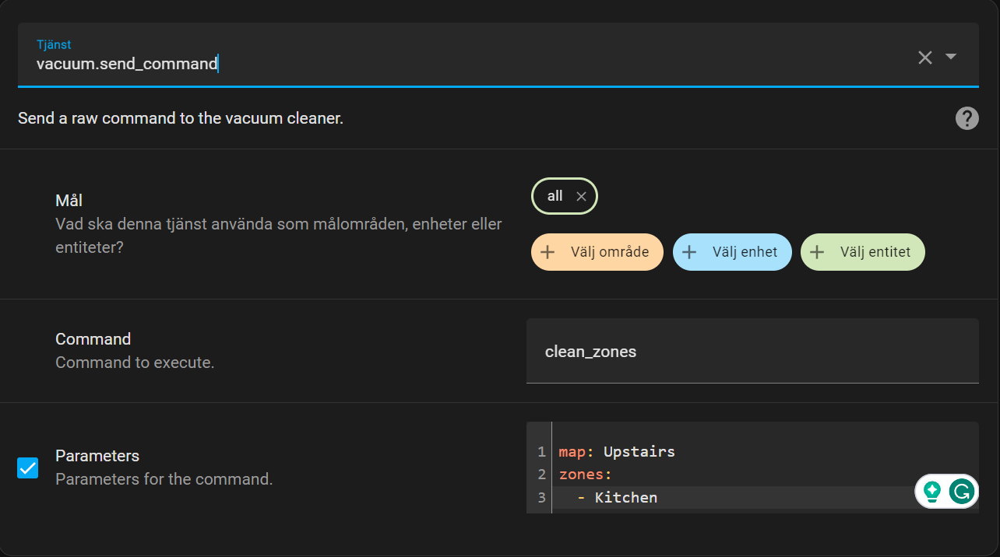

# Manual

The integration supports the basic commands: start, stop, pause and return to dock. Additionally, you can set fan speed
and view the dustbin status. This integration is not clever and does not try to implement features of its own, it simply
passes data back and forth to the Pure i9 API.

## Fan speed

For older vacuums there's two fan speeds and for newer three.

### Pure i9.2

For the newer models the name of the fan speeds are:

| Name |
| --- |
| QUIET |
| SMART |
| POWER |

### Pure i9

For the older models the name of the fan speeds are:

| Name |
| --- |
| ECO |
| POWER |

## Dustbin

You can read the dustbin status of the vacuum using the attribute `dustbin`. The values of the dustbin can be:

| Name | Description |
| --- | --- |
| UNKNOWN | No information available |
| CONNECTED | The vacuum is ready to be used |
| DISCONNECTED | There is no dustin connected |
| FULL | It's full and needs to be removed and emptied |

## Additional commands

Additionally, the vacuum supports sending raw commands using the `vacuum.send_command` service. Here's all available commands:

| Name | Description | Parameters |
| --- | --- | --- |
| `clean_zones` | Cleans only specific zones. For a list of map- and zone names, see attributes on the vacuum entity. | `map` is the name of the map and `zones` is a list of the name of zones to clean. |

### Example

For instance, if you want to clean the zone "Kitchen" in the map "Upstairs" then you need to send the following command:

